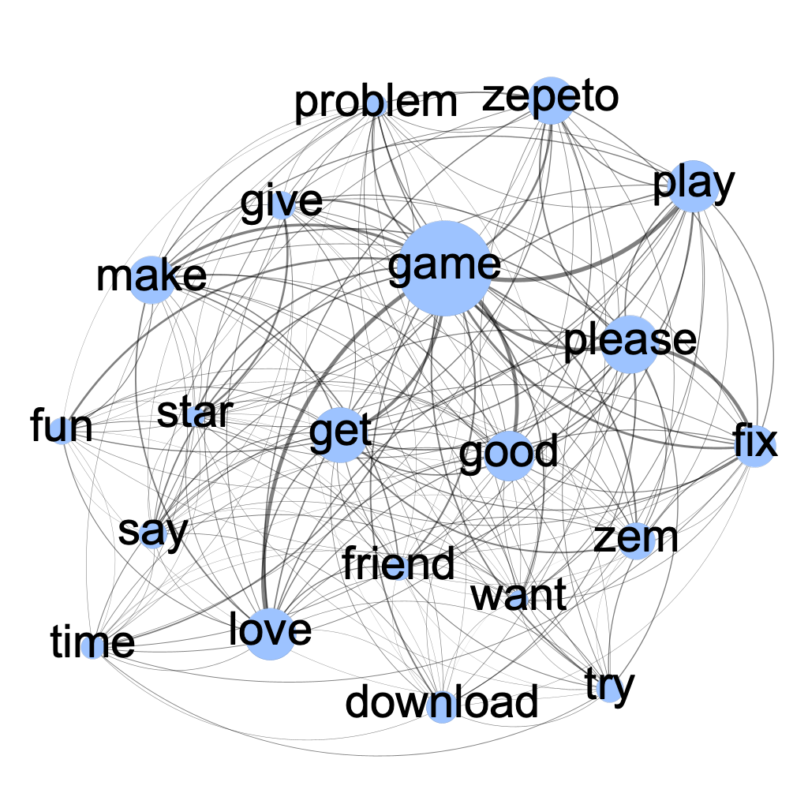

# Bridging Academic Perspectives and Real-World Services of the Metaverse: Defining Concepts and Analyzing User Experience.

This repository is the official dataset and code for the paper 'Bridging Academic Perspectives and Real-World Services of the Metaverse: Defining Concepts and Analyzing User Experience.' The link for paper is given [here](https://sites.google.com/view/dxlab/).

## Sample Result
As a result of the execution, you would be able to get the word co-occurrence network and the metrics used for the keywords. The example word co-occurrence network are given as below.
 | 
-- | -- |

## Prerequisites
You have to download several resources that are needed before you run the actural code under `utils` directory or on your environment. The files that should be downloaded are as follows.

- Jamspell corrector binary file (en.bin): [Jamspell Official Repo](https://github.com/bakwc/JamSpell)
- spaCy binary file: `python -m spacy download en_core_web_sm`
- FastText binary file(lid.176.bin): [FastText Language identification model](https://fasttext.cc/docs/en/language-identification.html)

## Requirements
```shell
python==3.8.18
numpy==1.24.4
pandas==2.0.3
nltk==3.8.1
spacy==3.7.5
jamspell==0.0.12
fasttext==0.9.1
networkx==3.1
```

## Repository Structure

Our repository comprises of the following structure.

```shell
├── README.md
├── graphs
│   ├── roblox.graphml
│   └── zepeto.graphml
├── keywords
│   ├── roblox.csv
│   └── zepeto.csv
├── requirements.txt
├── reviews
│   ├── roblox1.csv
│   ├── roblox2.csv
│   ├── roblox3.csv
│   ├── roblox4.csv
│   ├── roblox5.csv
│   └── zepeto.csv
├── src
│   └── main.py
└── utils
    ├── en.bin
    └── lid.176.bin
```

The description and role of directory are as follows.
- graphs: The word co-occurrence network as a result of the execution would be stored here.
- keywords: The keywords and the metrics corresponding to them would be stored here.
- reviews: The original reviews are stored here.
- src: The code is stored here.
- utils: You should download necessary resources here.

## Usage
Run `python main.py` under src directory.